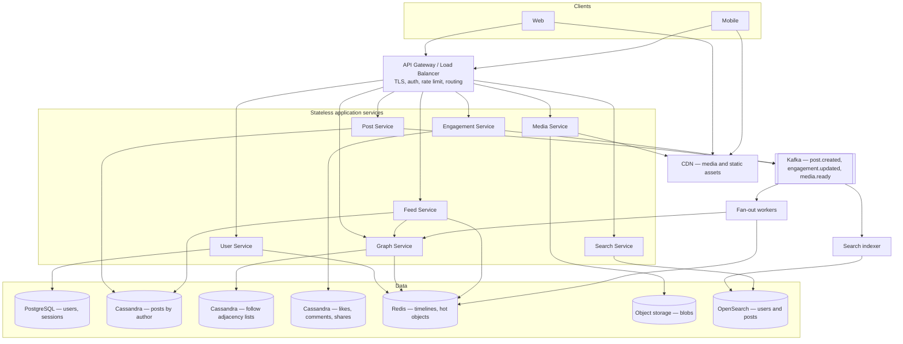
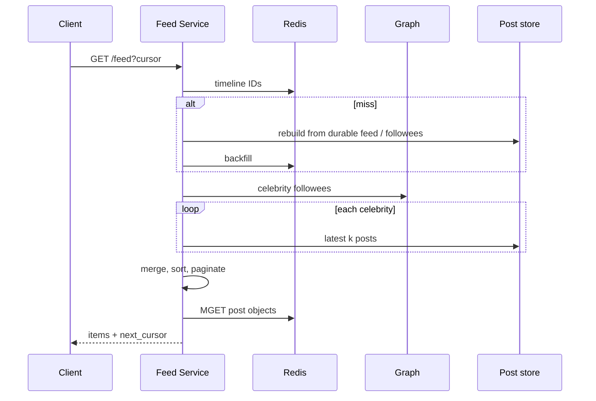

# News Feed System — High-Level Design

UnsaidTalks HLD assignment. This document is the production shape of a Facebook / Instagram / Twitter-style feed. The Python package in this repository is a runnable in-memory slice of the same interfaces.

## 1. Problem and scope

Users follow other users, publish posts (text, image, video, link), and read a **personalized reverse-chronological feed** of people they follow. They like, comment, and share. Search and trending exist as discovery surfaces.

**In scope:** user identity, follow graph, posts + media metadata, feed generation, engagement, search/trending, pagination, hybrid fan-out.

**Out of scope for v1 (called out so they are not silently assumed):** ads, DMs, live video, stories/reels expiry, full ML ranking, content-moderation ML, multi-region active-active.

### 1.1 Functional requirements

| Area | Capabilities |
| --- | --- |
| User management | Register, authenticate, follow/unfollow, profile + activity history |
| Content | Create/edit/delete own posts; text; image/video upload; links |
| Feed | Personalized feed of followees; newest first; cursor pagination; refresh |
| Engagement | Like/unlike, comment, share; denormalized counts on the post |
| Discovery | Search users and posts; trending; recommended content is optional |

### 1.2 Non-functional requirements

| Attribute | Target |
| --- | --- |
| Scalability | Millions of users, billions of posts, traffic spikes |
| Availability | 99.99% (≈ 52 min/year); no single point of failure |
| Performance | Feed generation **p95 ≤ 500 ms** |
| Consistency | **Eventual** for feeds; **strong** for auth, follow, and post create ACK |
| Reliability | Durable posts; recoverable after node/AZ loss |
| Extensibility | New content types, engagement kinds, ranking without rewriting the write path |

### 1.3 Working scale (design numbers)

These numbers size caches, Kafka, and fan-out workers. They are planning assumptions, not SLOs.

| Metric | Value |
| --- | --- |
| DAU | 50 million |
| Peak feed reads | ~250k QPS |
| Peak post creates | ~8k QPS |
| Average follows / user | 200 |
| Celebrity threshold | **10,000 followers** (production); demo uses 3 so both paths are testable |
| Feed cache depth | 800 post IDs per active user |
| Media | Object storage + CDN; APIs store URLs only |

Read/write ratio is about **30:1**. That is why the design spends complexity on making **reads** cheap.

---

## 2. System architecture



Every application service is **stateless**. Scale by adding instances behind the gateway. Durable state lives in the data plane. Kafka is the buffer between “post is saved” and “every follower’s timeline is updated.”

### 2.1 Component responsibilities

| Component | Responsibility |
| --- | --- |
| API gateway | TLS, JWT validation, per-user rate limits, routing, request IDs |
| User service | Register, login, profile, password hash, session/token issue |
| Graph service | Follow/unfollow, follower and following lists, celebrity flag |
| Post service | CRUD on posts, ownership checks, emit `post.created` / `post.deleted` |
| Media service | Direct-to-storage upload URLs, transcode jobs, CDN URLs |
| Feed service | Assemble the home timeline: cache hit, or merge push + celebrity pull |
| Engagement service | Idempotent like, comments, share; bump denormalized counters |
| Search service | Query OpenSearch; trending window |
| Fan-out workers | Consume `post.created`; push post IDs into followers’ Redis timelines **unless** the author is a celebrity |
| Redis | Home timelines (sorted sets), hot posts, hot profiles, celebrity set |
| Kafka | Async fan-out, search index, counter aggregation, notifications later |
| PostgreSQL | Users and credentials — strong consistency, unique constraints |
| Cassandra | Posts, follows, engagements — high write volume, partition-friendly keys |
| Object storage + CDN | Image/video bytes; origin never serves blobs on the feed path |

The demo maps 1:1 onto these names. Redis becomes `LruTtlCache` + in-memory sorted lists. Cassandra/Postgres become repository maps. Kafka fan-out runs in-process after `create_post`.

---

## 3. Feed generation strategy

This is the decision that determines whether the 500 ms budget is realistic.

### 3.1 Options

| Strategy | Mechanism | Strength | Weakness |
| --- | --- | --- | --- |
| **Fan-out on write (push)** | On create, write the post ID into every follower’s precomputed timeline | Feed read is a Redis range — well under 500 ms | A 10M-follower account causes 10M writes per post |
| **Fan-out on read (pull)** | At read time, fetch recent posts from every followee and merge | Write path stays O(1) | A user following 2,000 accounts does 2,000 scatter-gather reads |
| **Hybrid (chosen)** | Push for normal authors; pull celebrity authors at read time | Cheap common-case reads; celebrity writes stay O(1) | Feed assembly must merge two sources and dedupe |

**Choice: hybrid.** Social graphs are heavily skewed. Almost all accounts sit under 10k followers; a tiny set of celebrities produce a large fraction of write amplification. Push those two populations through different paths.

### 3.2 Celebrity handling

An author is a **celebrity** when `follower_count ≥ CELEBRITY_THRESHOLD` (10,000 in production). The graph service keeps this flag on the user record and in Redis `celebrity:{user_id}`.

**Write path**

1. Post service persists the post (strong durability), then publishes `post.created`.
2. Fan-out worker loads `follower_count`.
3. If **not** celebrity: for each follower, `ZADD timeline:{follower_id} score=created_at member=post_id`. Cap the set at 800 members (trim oldest).
4. If celebrity: **do not fan out.** The post lives only on the author’s post partition.

**Read path**

1. `ZREVRANGE timeline:{user_id}` → precomputed IDs.
2. Load followees marked celebrity (usually a handful).
3. For each, pull the last *k* posts from `posts` partitioned by `author_id`.
4. Merge by `created_at` descending, drop deleted IDs, hydrate objects from the post cache.
5. Return a page + `next_cursor`.

Inactive users do not need a hot timeline. If Redis misses, rebuild from Cassandra `precomputed_feed` (or lazily from followees if the user is cold) and backfill Redis.

### 3.3 Pagination and refresh

**Cursor pagination**, not `OFFSET`. The cursor is `(created_at, post_id)` encoded as opaque base64. New posts arriving while the user scrolls cannot shift page 2 the way `LIMIT 20 OFFSET 40` would.

Refresh is `GET /feed` with no cursor (or `since=now`). It reads the head of the merged list. Optional: WebSocket / SSE for “N new posts” badges; the poll/refresh API remains the source of truth.

---

## 4. Database design

One store cannot serve users (strong, low volume), posts (huge, key lookup), and the follow graph (asymmetric adjacency lists). The design is **polyglot**.

### 4.1 Store choice

| Entity | Store | Why |
| --- | --- | --- |
| User, credentials | PostgreSQL | Unique email/username, transactions on register/login |
| Post | Cassandra (PK `author_id`, clustering `created_at DESC`) | Billions of rows; “latest posts by author” is the celebrity pull query |
| Follow | Cassandra, **two tables** | Fast “followers of X” (fan-out) **and** “who I follow” (celebrity pull) |
| Like / comment / share | Cassandra | High write QPS; partition by `post_id` |
| Precomputed feed (durable backup of Redis) | Cassandra PK `user_id` | Rebuild timelines after cache loss |
| Search | OpenSearch | Full-text + trending aggregations |
| Media bytes | S3 + CDN | Never store blobs in Cassandra/Postgres |

SQL vs NoSQL is not a religious choice: **users need constraints; timelines need partitions.**

### 4.2 Schema

```
users                          -- PostgreSQL
  user_id           UUID PK
  username          UNIQUE
  email             UNIQUE
  password_hash
  display_name
  bio
  avatar_url
  follower_count    INT        -- denormalized
  following_count   INT
  is_celebrity      BOOL
  created_at

posts                          -- Cassandra
  author_id         PK
  created_at        clustering DESC
  post_id
  content
  media_type        NONE | IMAGE | VIDEO | LINK
  media_url
  like_count, comment_count, share_count
  deleted           BOOL
  updated_at

posts_by_id                    -- Cassandra lookup table
  post_id           PK
  author_id, created_at        -- enough to fetch the canonical row

follows_by_followee            -- "who follows me" — fan-out
  followee_id       PK
  follower_id       clustering
  followed_at

follows_by_follower            -- "who I follow" — feed merge
  follower_id       PK
  followee_id       clustering
  followed_at

likes
  post_id           PK
  user_id           clustering
  liked_at

comments
  post_id           PK
  created_at        clustering
  comment_id
  author_id
  content

shares
  post_id           PK
  user_id, created_at, share_id

precomputed_feed
  user_id           PK
  created_at        clustering DESC
  post_id
  author_id
```

Follow writes **both** adjacency tables in the graph service (or a single logged write with a projection). Dual-write is cheaper than scanning the wrong direction at fan-out time.

### 4.3 Sharding and replication

- **Users:** hash shard on `user_id`; sync replica in-region for auth.
- **Posts:** partition `author_id` so celebrity pull is one partition read, not a scatter.
- **Followers of a celebrity:** `follows_by_followee` for a huge followee **is** a wide partition. Mitigate with bucketed clustering (`followee_id + bucket`) or a dedicated graph store (TAO-style) if a single partition exceeds Cassandra practical limits.
- **Likes on a viral post:** hot partition on `post_id`. Split counters into *N* sub-counters (`post_id#shard`) and sum on read.
- **Replication:** three replicas across AZs. Cassandra quorum `LOCAL_QUORUM` for post create. Redis Cluster with replica + AOF. PostgreSQL primary + sync standby.

---

## 5. API design

REST, JSON, JWT in `Authorization: Bearer`. IDs are UUIDs. Feed is cursor-based.

### 5.1 Users and graph

| Method | Path | Notes |
| --- | --- | --- |
| `POST` | `/v1/users` | Register `{username, email, password, display_name}` |
| `POST` | `/v1/auth/login` | Returns access token |
| `GET` | `/v1/users/{id}` | Public profile |
| `GET` | `/v1/users/{id}/history` | Profile + recent posts + counts |
| `PUT` | `/v1/users/{id}/following/{targetId}` | Follow (idempotent) |
| `DELETE` | `/v1/users/{id}/following/{targetId}` | Unfollow |
| `GET` | `/v1/users/{id}/followers` | Paginated |
| `GET` | `/v1/users/{id}/following` | Paginated |

### 5.2 Posts and media

| Method | Path | Notes |
| --- | --- | --- |
| `POST` | `/v1/posts` | `{content, media_type, media_url}` — author from JWT |
| `GET` | `/v1/posts/{id}` | Single post |
| `PATCH` | `/v1/posts/{id}` | Author only |
| `DELETE` | `/v1/posts/{id}` | Soft delete; author only |
| `GET` | `/v1/users/{id}/posts` | User timeline |
| `POST` | `/v1/media/upload-url` | Presigned PUT to object storage |

### 5.3 Feed and engagement

| Method | Path | Notes |
| --- | --- | --- |
| `GET` | `/v1/feed?cursor=&limit=` | Home timeline; default `limit=20`, max 50 |
| `POST` | `/v1/posts/{id}/likes` | Idempotent like |
| `DELETE` | `/v1/posts/{id}/likes` | Unlike |
| `POST` | `/v1/posts/{id}/comments` | `{content}` |
| `GET` | `/v1/posts/{id}/comments?cursor=` | |
| `POST` | `/v1/posts/{id}/shares` | |

### 5.4 Search

| Method | Path | Notes |
| --- | --- | --- |
| `GET` | `/v1/search?q=&type=user\|post` | |
| `GET` | `/v1/trending?limit=` | Recency-weighted engagement |

**Errors:** `{ "error": { "code", "message", "request_id" } }` with `400` / `401` / `403` / `404` / `409` / `429`.

Demo server uses the same paths without the `/v1` prefix and passes `userId` in JSON instead of JWT.

---

## 6. Data flow

### 6.1 Create post (write)

```mermaid
sequenceDiagram
    participant C as Client
    participant P as Post Service
    participant DB as Post store
    participant K as Kafka
    participant W as Fan-out worker
    participant G as Graph
    participant R as Redis timeline

    C->>P: POST /posts
    P->>DB: insert post (durable)
    P->>K: post.created
    P-->>C: 201 {post_id}  %% does not wait for fan-out
    K->>W: consume
    W->>G: follower_count / celebrity?
    alt normal author
        W->>G: list followers
        loop each follower
            W->>R: ZADD timeline
        end
    else celebrity
        Note over W: skip push; pull on read
    end
```

Author latency is “persist + enqueue,” not “write N timelines.” That keeps create well under 500 ms even when N is large.

### 6.2 Read home feed



### 6.3 Like (engagement)

Client → Engagement service → insert like row (idempotent on `(post_id, user_id)`) → increment counter (or Kafka `engagement.updated` for async counter) → invalidate `post:{id}` cache. Feed entries store IDs only, so like counts appear on the next hydrate.

---

## 7. Design decisions and trade-offs

| Decision | Alternative | Why this |
| --- | --- | --- |
| Hybrid fan-out | Pure push or pure pull | Hits 500 ms for typical readers without melting the cluster on celebrity writes |
| IDs in Redis, hydrate on read | Store full post JSON in every timeline | Memory: 800 × 16 B vs 800 × ~1 KB per user; one edit/delete updates one object |
| Cursor pagination | Offset | Stable infinite scroll on a mutating list |
| Async Kafka fan-out | Sync fan-out in POST /posts | Author p95 stays independent of follower count |
| Postgres for users, Cassandra for posts | Single Postgres | Unique auth constraints vs billion-row append-only posts |
| Denormalized counts on `posts` | `COUNT(*)` at read | Feed cards need counts in the 500 ms budget |
| Soft delete | Hard delete | Tombstones propagate; fan-out skips deleted IDs on hydrate |
| 10k celebrity threshold | Fixed 1M or none | Function of fan-out worker capacity; 10k caps worst-case push; tunable |
| Eventual feed consistency | Strong feed | A follower may miss a post for a few seconds; auth and “create succeeded” stay strong |
| Recommended content optional | Always mix in discovery | Keeps v1 ranking chronological as the assignment requires; ranking is a later stage on the same candidate set |

**Known costs of hybrid:** a user who follows 50 celebrities pays 50 extra partition reads on cache miss. Parallelize those reads. If that set grows, raise the threshold or cap “pull celebrities” to the most-interacted N.

**Viral post:** inbound likes concentrate on one `post_id`. Counter sharding + write-behind Kafka + cache the post object with a short TTL.

---

## 8. Mapping to the bonus implementation

| HLD idea | Code |
| --- | --- |
| Hybrid fan-out | `FeedService.on_post_created` / `get_feed` |
| Celebrity threshold | `FollowService.CELEBRITY_THRESHOLD` (3 in demo) |
| Timeline of IDs | `FeedRepository` |
| LRU + TTL cache | `LruTtlCache` |
| Cursor pagination | `FeedService._paginate` |
| Idempotent likes | `EngagementService.like` |
| Layered services | `newsfeed/services.py` behind `newsfeed/api.py` |
